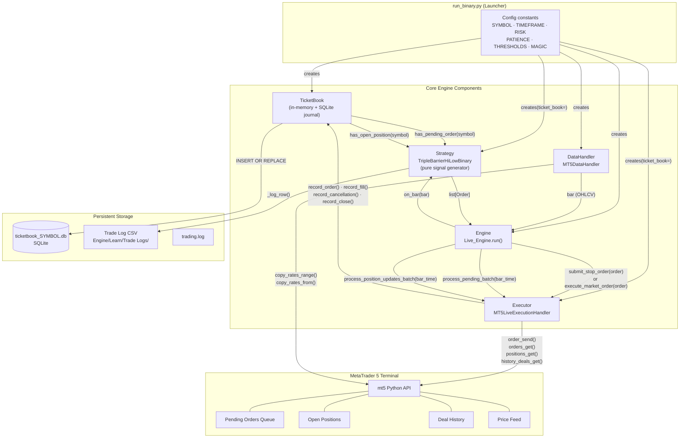
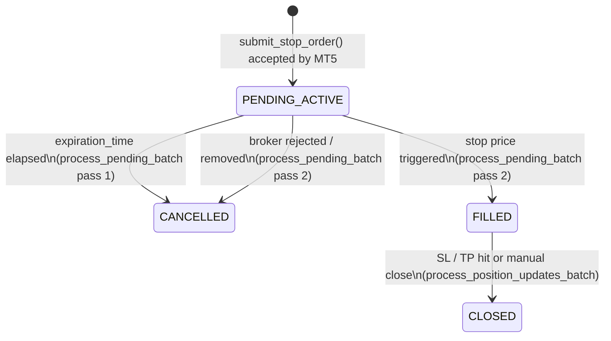

# Trading System Architecture

## Overview

This system is a live algorithmic trading engine that connects to a local MetaTrader 5 terminal. It is built around a strict separation of concerns: the strategy generates signals only, the executor owns all MT5 interaction, and the TicketBook is the single source of truth for order and position state.

---

## Component Map



---

## Per-Bar Execution Sequence

Each bar triggers the following sequence inside `Live_Engine.run()`:

```
1. DataHandler.get_next_bar()        → yields one OHLCV bar
2. Strategy.on_bar(bar)
   a. Appends bar to internal price buffer
   b. Queries TicketBook for pending/position state (no MT5 call)
   c. Runs model inference if buffer is full and state is flat
   d. Returns list[Order] (empty if no signal, or state is blocked)
3. For each Order in list:
   └─ Executor.submit_stop_order(order)
      a. Sends TRADE_ACTION_PENDING to MT5
      b. Records the new order in TicketBook
4. Executor.process_pending_batch(bar_time)
   ├─ Pass 1 — Expiry: cancel any pending orders past their expiration_time
   └─ Pass 2 — Fill detection: for orders no longer in MT5 queue,
               search deal history → record_fill() or record_cancellation()
5. Executor.process_position_updates_batch(bar_time)
   └─ For every FILLED position: check mt5.positions_get(ticket=)
      If gone → search deal history for DEAL_ENTRY_OUT → record_close()
```

---

## Order Lifecycle (TicketBook States)



> `PENDING_SUBMITTED` and `REJECTED` are defined in the enum for future use  
> (e.g. multi-step order confirmation or explicit broker rejection handling).

---

## Component Responsibilities

| Component | Owns | Does NOT own |
|---|---|---|
| **run_binary.py** | Wiring, config, logging setup, graceful shutdown | Any trading logic |
| **MT5DataHandler** | Fetching bars from MT5 (live or replay) | Strategy state |
| **Live_Engine** | Per-bar orchestration loop | Order logic, MT5 calls |
| **Strategy** | Signal generation, order sizing, trade logging | MT5 calls, state mutation |
| **MT5LiveExecutionHandler** | All MT5 API calls, order submission, lifecycle batches | Signal generation |
| **TicketBook** | In-memory order state, SQLite persistence, query interface | MT5 calls, strategy logic |

---

## Creating a New Strategy Instance

1. Copy `run_binary.py` to e.g. `run_xauusd.py`
2. Replace all values marked `# <-- REPLACE`
3. Set a unique `MAGIC` number — MT5 uses this to distinguish different EAs
4. Set `DB_PATH` to a unique filename so journals don't collide
5. Run with `python Engine/run_xauusd.py`

Key things that **must** be unique per running instance:
- `MAGIC` — prevents conflicting order operations between instances
- `DB_PATH` — prevents TicketBook state from being shared across symbols

---

## File Map

```
Engine/
├── run_binary.py               Launcher / template — copy per strategy instance
├── Engine.py                   Live_Engine: per-bar orchestration loop
├── DataHandler.py              MT5DataHandler + Order dataclass
├── Executor.py                 MT5 order submission + lifecycle batch processing
├── TicketBook.py               Dual-storage order journal (in-memory + SQLite)
├── StrategyBinary.py           TripleBarrierHiLowBinary: dual-model signal generator
├── Strategy.py                 TripleBarrier / TripleBarrierHiLow / _XAUUSD variants
├── Learn/
│   ├── Models.py               LSTM / TCN / Transformer model definitions
│   ├── features.py             Feature engineering
│   ├── preprocess.py           Data preprocessing / scaling
│   ├── train.py                Model training loop
│   └── Trade Logs/             Per-run CSV prediction + action logs
└── Model Packs/                Serialised model weights + metadata (.pkl)
```
